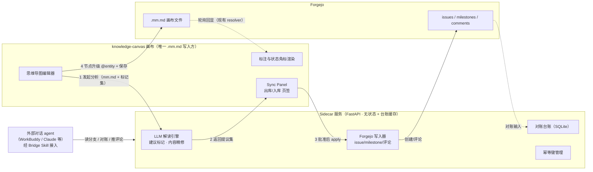

# 导图 × Forgejo 智能联动设计（Mindmap-Forgejo Sync）

| 项 | 值 |
|---|---|
| 日期 | 2026-08-27 |
| 状态 | 参考消费者规格 · 等内核重构（R12 总路线重排，见 §4.6 / §11） |
| 决策人 | 蒋指导（产品与技术决策）、WorkBuddy（设计执笔） |
| 关联项目 | knowledge-canvas（画布）、private-docs-forge（Forgejo 实例 :3001） |
| 增补 | R5-R15：节点关系与圈定（§5.4）、存储格式与双层定义（§5.5 含快速注释 qa）、Sidecar 内部结构与三通道接入（§8）、内核定义与架构原则（§4.4）、扩展缝矩阵（§4.5）、微内核架构与总路线重排（§4.6）、实体中心接入模型与渐进增强（§4.7）、平台选型与部署存储基线（§4.8） |

---

## 1. 背景与问题（Why）

思维导图是人类「发散构思 → 收敛规划」的最佳介质，Forgejo issue/milestone 是「执行追踪」的最佳介质，两者本是一条流水线的上下游，但目前断裂：

1. **纪律成本高**：「需求先开 Issue」纪律完全手动——导图上想清楚了，还要到 Forgejo 重写一遍 issue
2. **冷启动困境**：没有顺畅的 issue/milestone 积累，画布的实体节点模式（`@issue`/`@milestone` 引用）形同鸡肋
3. **上下文割裂**：vibecoding 开发中，外部对话 agent（如 WorkBuddy）无法直接读取导图分支及其关联 issue 的评论小问题，讨论时上下文不全
4. **漂移不可见**：用户有时直接在 Forgejo 页面键入回复或新建 issue，导图与 Forgejo 记录出现不一致，且无机制发现

**核心判断**：不做双向实时对等同步（心智负担超过直接写 issue，舍本逐末）；做「导图为构思源头、agent 精修翻译、Forgejo 为执行投影」的单向流水线 + 可见的对账回流。

## 2. 目标与非目标

### 目标

1. 画布上自由发散（普通文本节点零负担），手动标记落库意图后，agent 一键生成精修的 issue/milestone
2. AI 解读导图、反向以 annotation 标记节点语义，但**落库决策权始终在人**
3. 对话 agent（WorkBuddy 等）经统一桥读取导图分支 + 关联 issue 评论合并视图，讨论认可的结论可推送为 issue 评论
4. 对账：Forgejo 侧漂移（新实体、新评论、状态变化）可被发现、以「入库提议」形式回流导图
5. 语义关系连线（`blocks` 等）随落库映射为 Forgejo issue 依赖；选框圈定支持批量标记 milestone（吸收自 MarkVault-JS MindFlow 设计）

### 非目标（Non-goals）

- 不做双向实时对等同步（issue 内容变更不自动改写导图）
- **不修改协议层**（parser/serializer 零改动，round-trip 铁律不触碰）
- 首期不做 Sidecar 直接写 `.mm.md`（受限写入留待 Phase 2 决策，见开放问题 Q1）
- 不做定时自动批处理（sidecar 保持按需触发；夜间批处理为二期可选演进）
- 不做 issue 内容的自动翻译回写（导图节点文本永远由人编辑）

## 3. 已锁定决策（五项澄清）

| # | 决策点 | 结论 |
|---|---|---|
| 1 | 数据权威 | 导图为主（构思源头），agent 精修写入 Forgejo 流水线；issue 侧变化以标记/角标回显，不自动改写导图 |
| 2 | Agent 载体 | Sidecar 服务（FastAPI，与 Forgejo 同机部署）；LLM key 不进浏览器 |
| 3 | 审批门禁 | 提议 → 人批 → 写入；对话场景中「自然语言确认」等价于批准按钮 |
| 4 | 节点类型 | 混合模式：**落库动作（issue/milestone）全部手动标记**，AI 推断降级为「建议标记」；其余语义由 AI 推断 |
| 5 | 评论回路 | 导图 → 评论单向推送 + Forgejo 侧评论以角标/摘要回显 |

## 4. 架构：画布主权（方案 A）

### 4.1 核心不变量

**`.mm.md` 只有一个写入方：knowledge-canvas 画布**（经现有 saveGate/CAS/409 三向合并保存链路）。Sidecar 只读导图、只写 Forgejo 工单；两者通过「提议集（ProposalSet）」对话。画布与外部对话 agent 是 Sidecar 的两个平权客户端。

由此：**双写冲突为零**，现有 326 个测试覆盖的保存/合并/轮询机制一行不改。

### 4.2 架构图



### 4.3 选型记录（三方案对比）

| 维度 | A 画布主权（选定） | B Sidecar 主权 | C 脚本流水线 |
|---|---|---|---|
| `.mm.md` 双写冲突 | 无 | 有（409 合并兜底） | 有（人工时序回避） |
| 审批体验 | 画布内 Sync Panel | Sidecar 独立页面 | 报告文件批注 |
| 构建成本 | 中 | 中高 | 低 |
| 现有测试资产复用 | 全部 | 部分 | 大部分 |
| 演进空间 | 好 | 最好 | 差 |

选 A 的理由：核心痛点是冷启动，需要顺手的日常工具而非一次性脚本；A 在保证一致性前提下成本可控，且可吸收 C 的优点作为 Phase 1（CLI 验证提示词）。

### 4.4 内核定义与架构指导原则（R10，调研背书）

> 依据 `docs/research/2026-08-27-mindmap-forgejo-sync-oss-research.md`（Terraform / Renovate / Markmap / GitHub MCP Server 深度调研）。

**内核（一句话）：Terraform for ideas——把想法当基础设施管理：导图声明期望态，桥执行受控变更，对账发现漂移，人握住每一个 apply。**

三元组展开：

1. **文本协议画布**：`.mm.md` 单一事实源，人机同读，透传兼容演进
2. **提议门禁执行器**：analyze = plan（只读、可审查、指纹绑定、可作废）；apply = 执行（幂等、逐条回报）；人批 = 硬门禁（架构属性，非 agent 自律）
3. **漂移对账**：导图 = desired state，Forgejo = actual state；台账 = state file（缓存可重建）；漂移只报告，修复必须经 inbound 提议人工接受

十条架构指导原则：

| # | 原则 | 来源 | 落点 |
|---|---|---|---|
| P1 | 两相分离 + pivot 数据契约 | Markmap IPureNode | MindNode AST 是唯一契约；relations v2 解析不碰渲染 |
| P2 | 被审查的 = 被执行的 | Terraform plan artifact | node_anchor 指纹绑定；失配即 stale |
| P3 | 机器提议、人类合并 | Renovate（已在 Forgejo 验证） | ProposalSet 人批门禁 |
| P4 | 状态是缓存不是事实 | Terraform state | 台账删除重建即全量对账 |
| P5 | 漂移只 triage 不自动修复 | Terraform drift 实践 | inbound 提议必须人工接受 |
| P6 | 汇总仪表盘对抗遗漏 | Renovate dashboard | 对账报告 = 待同步项单一视图 |
| P7 | 噪音控制是设计面 | Renovate limit/分组 | 见 §7.1 噪音控制条款 |
| P8 | 可解释「为什么没有」 | Renovate debug 日志 | analyze 须能解释 skip/低置信原因 |
| P9 | 只读默认 + 写显式开启 | GitHub MCP readOnlyHint | 见 §6.2 鉴权条款 |
| P10 | 工具聚合 + 自描述 | GitHub MCP toolset/instructions | MCP 面 5 个多方法工具；`/schema` 即 server instructions |

### 4.5 扩展缝矩阵与演进策略（R11）

**底座原则：数据永不丢失，渲染尽力而为。** 由三个已验证的透传机制保障：未知 kind 透传（W-UNKNOWN-KIND，保留为实体节点）、未知 note 键透传、round-trip 全链路保证。新需求存不坏旧文件，旧程序看不懂数据也不丢数据。

**扩展缝矩阵**（新需求判定表——先问「数据是什么」，对号入座）：

| 需求形态 | 落点 | 稳定性代价 |
|---|---|---|
| 新交互/渲染效果（节点翻转、背面 note、聚焦、动画） | MapView 渲染层 | 零（note 数据已存在，翻转即渲染交互） |
| 新节点数据字段 | note 透传键 | 零 |
| 新语义词汇（SemRole / 关系类型 / kind） | `semantics.json` 次版本 | 零（未知值透传 + 上报） |
| 新内容类型（SVG 绘图、富文本嵌入） | 新 kind + 资产目录约定 + 渲染器 | 零（旧版 W-UNKNOWN-KIND 降级为通用实体角标） |
| 新落库动作（如 create_doc） | action 枚举 + sidecar 模块 | 次版本（幂等键域扩展） |
| 新客户端/接入方式 | 三通道适配层 | 零 |

**新内容类型的降级路径（以 FreeCanvas 式 SVG 节点为例）**：新 kind `@draw:assets/scene-1.svg`——资产文件存 repo（经 contents API），节点存引用；新版画布注册 `draw` 进 `semantics.json` 后富渲染；**旧版画布打开同一文件按未知 kind 透传，显示通用实体角标，不白屏不丢数据**；语义层在 `/schema` 声明 `maps_to: doc`（或不落库），词汇表 +1 即次版本。

**演进纪律（三条，硬约束）**：

1. 协议语法新增必须过 round-trip 双向 TDD（旧文件/旧解析器双向安全）
2. 新 kind 必须同步进 `semantics.json`——`/schema` 是唯一事实源，禁止「代码里有、注册表里没有」的影子词汇
3. 资产引用只能走已有 url / EntityRef 字段，不开新存储通道

### 4.6 微内核插件架构与总路线重排（R12）

**架构范式：微内核（Microkernel）+ 注册表插件 + 适配器**，四层：

1. **纯思维导图内核**：protocol 语法 / 布局引擎 / 编辑器 / 保存管线（saveGate·CAS/409）——插件不可触碰
2. **扩展点注册表**：内核暴露的六个正式插口——`kind`（实体种类→解析/校验/图标）、`note 键`（links/groups/ai_role 语义处理器）、`渲染器`（节点类型→渲染策略）、`布局`（已有 6 布局注册表）、`SemRole/action`（落库映射）、`通道`（接入方式）——R11 演进纪律的物理执法者
3. **功能插件**：可增删、各自版本化；**forgejo-bridge 是首个插件**（吃自己的狗粮验证插口设计）
4. **接入通道**：插件经三通道（REST/MCP/Skill）暴露能力

成熟度阶梯：L1 模块化 monorepo（现状，已达到）→ **L2 注册表插件（import 时组合，本设计目标）** → L3 运行时外部插件（manifest+沙箱，出现第三方插件需求再升级）。**停在 L2**（YAGNI：现阶段插件均自研，L2 注册表规范正是 L3 的前置投资，升级不返工）。

**总路线重排（动因：纯思维导图内核仍在架构/功能/性能探索期，未定型）**：

```
① 纯思维导图内核重构（架构 + 功能探索 + 高性能）
   约束：微内核四层、六注册表、透传铁律、P1-P10
   镜子：三份消费者规格（见下）
② forgejo-bridge 作为首个插件落地（本 spec 直接实施）
③ 更多项目特性化适配（GitHub / Jira / PomodoroXI / MarkVault…）——各自插件
```

**「两个消费者」规则**：一个 API 边界在被至少两个消费者压力测试之前，都当它是猜的。内核重构期间不实现任何插件，但每设计一个扩展点，必须用三面镜子验收：

| 镜子（参考消费者规格） | 压力测试点 |
|---|---|
| 本 spec（Forgejo 联动，R1-R11） | kind 注册 / SemRole 映射 / 通道 / 提议集数据流 |
| MarkVault-JS MindFlow 标注系统设计 | note 键注册 / 渲染器 / annotation kind / structureType |
| PomodoroXI session 接入设想 | 新 kind（`session:42`）/ resolver / 对账 |

**本文档角色声明**：本 spec 自 R12 起从「实施蓝图」变更为**首个参考消费者规格 + 新内核插件面验收清单**——内核重构期间作为扩展点设计的验收标尺使用；实施推迟至内核定型、forgejo-bridge 插件立项时（§11 分期相应顺延）。

### 4.7 实体中心接入模型与渐进增强（R13）

**实体中心接入模型**——一切项目接入皆实体引入与消费，每个接入项目 = 一份三段式契约：

| 段 | 内容 |
|---|---|
| 实体声明 | kind 语法与校验 + 语义（`/schema`）+ 图标颜色 |
| 读管道 | resolver 从源拉取 → Entity 统一形状 → 角标 / 状态回显 / 分支合并视图 |
| 写管道 | SemRole 映射 → 提议 → 门禁 → action 落库 + 对账 reconcile |

三例映射：Forgejo（`issue`/`milestone`/`pr`：读角标+评论视图，写提议创建）、markvault-reborn（`annotation`，**kind 已注册**：读标注节点，写决策沉淀）、PomodoroXI（`session`/`task` 设想：读任务状态同步，写创建任务/番茄）。

**内核接口收敛（三件套）**：若实体中心论成立，内核要钉死的核心接口从六注册表收敛为——① **EntityRef**（引用怎么写：`@kind:id` + 透传）② **Entity 统一形状**（消费方拿到什么——已存在于 `src/protocol/types.ts`，含 `unresolved_reason` 降级）③ **resolver 契约**（谁供给：ref → Entity，失败返回 unresolved 而非抛异常）。六注册表其余部分（SemRole 映射 / action / 对账 / 通道）住插件侧——**内核的语义核心小到惊人，正是高性能内核想要的形态**。

**渐进增强架构（Obsidian 模式）**——「不引入实体时就是纯文本思维导图」的架构保证：

- **数据层（已天然成立）**：语法超集链——纯文本导图 ⊂ +实体 token ⊂ +links/groups——每层是上一层的语法超集，去掉 token 文件仍合法（透传机制已保证，零成本）
- **代码层（纯内核三规则）**：① kernel 零实体依赖（不 import 实体渲染/resolver，实体 token 降级为着色文本节点）② 注册表接口预留但允许空实现（插件列表为空时内核照常全功能运行）③ 入口即组合点（`app = kernel + [plugins]`，「纯文本版」与「完整版」是同一 codebase 的两个构建产物）
- **测试层**：kernel 套件必须全部在无插件配置下跑绿；golden 固化「带实体文件在纯内核打开 = 降级不损坏」；插件各有独立套件

**边界澄清**：实体中心论精确覆盖「项目接入」轴；渲染/交互类功能（翻转、SVG 富内容）不是项目接入，走扩展缝矩阵（§4.5）其他行——两轴正交。

**外部佐证**（内核调研第二辑）：tldraw ShapeUtil（组件+几何分离的注册单元）与 CodeMirror 6 extensions（极小核心+扩展）均为同构验证；Obsidian「CM6 嵌套在插件系统内」证明微内核可再套微内核、两层插件互不感知。

### 4.8 平台选型与部署存储基线（R14）

**平台决策：Web-first（PWA + local-first），库优先（library-first）**。

判据：① 三个目标全部 web 原生——DSH 接入（Web UI + localhost MCP）、导图中心（sidecar 即 hub）、其他项目嵌入副本（tldraw「画布基础设施」模式，桌面应用无法被嵌入）；② 性能瓶颈在渲染架构而非容器（tldraw/Excalidraw/Figma 全是 web）；③ 稳定性已被纯文本事实源解决（数据在 `.mm.md`/git，不在 IndexedDB）；④ 现有栈零学习成本。桌面后门保留：PWA 可安装；将来需要托盘/常驻时用 Tauri 包壳同一 web 内核，首期零成本。

**库优先包结构**（「其他项目获取副本局部快速接入」的实现形态）：

```
packages/kernel    ← headless：协议 / 布局 / 状态（零 React 依赖）
packages/react     ← 渲染器（消费 kernel）
apps/canvas        ← 完整应用（= kernel + plugins 组合入口）
```

其他项目接入：npm 依赖（首选）或拷贝自包含 `kernel` 包（真·副本）——tldraw 的引擎/UI 分离同构。

**部署基线（两阶段）**：

| 阶段 | 形态 | 说明 |
|---|---|---|
| 当前（局域网） | 静态产物同源部署进 Forgejo `/assets/canvas/`（现状零成本）；sidecar `localhost:3050` | 同源免 CORS；对话 agent（本机 DSH/WorkBuddy）直接可达 |
| 将来（公网） | Docker Compose：Forgejo + canvas 静态 + sidecar + 反代（Caddy/nginx）统一入口 → **Cloudflare Tunnel** 出公网 | HTTPS 自带；同源模式免 CORS、token 不进前端；与 PomodoroXI 既有 Cloudflare Tunnel 规划同栈 |

**数据存储分层**：

| 数据 | 存哪 | 性质 |
|---|---|---|
| 导图 `.mm.md` | Forgejo git 仓库 | **事实源**：版本化、可回滚、满足 local-first「长久性」 |
| 台账 / 幂等键 / 提议缓存 | sidecar SQLite（容器 volume） | 缓存，可删除重建 |
| LLM key / Forgejo token | sidecar 环境变量 | 密钥不进 git、不进前端（sidecar 是唯一持钥者） |
| 浏览器本地 | 仅 UI 偏好 | 无业务数据，存储驱逐风险不适用 |

**公网安全基线**：HTTPS 强制（Tunnel 自带）；双凭证 + agent key 只读默认（§6.2 AGENT_WRITE）；Forgejo 用 fine-grained PAT 最小权限；所有写路径走「提议→人批→写入」门禁；sidecar 不直接暴露公网（经反代 + 鉴权）。

## 5. 节点类型体系（SemRole）

### 5.1 七类语义角色

| SemRole | 含义 | 落库动作 | 标记方式 |
|---|---|---|---|
| `milestone` | 里程碑候选 | 创建/关联 milestone | **手动**，AI 可建议 |
| `task` | 待办任务 | 创建 issue（可挂 milestone） | **手动**，AI 可建议 |
| `question` | 待解分支问题 | 创建 issue + `question` 标签 | **手动**，AI 可建议 |
| `risk` | 风险 | 创建 issue + `risk` 标签 | **手动**，AI 可建议 |
| `decision` | 决策记录 | 不建实体，沉淀节点 `note.decisions` | 手动或对话中认可 |
| `context` | 背景/上下文 | 不落库，作为 issue body 背景段来源 | AI 推断 |
| `idea` | 发散点子 | 挂起点子池（ideas-pool 画布） | AI 推断 |

> 修订记录：初版设计中 `task/question/risk` 由 AI 推断后经审批创建；经用户修正为**落库动作全部手动标记**，AI 推断仅作为「建议标记」辅助（一键采纳），避免 AI 越权决定价值判断。

### 5.2 映射规则

- **milestone 归属**：issue 挂到「最近祖先 `milestone` 节点」——导图拓扑即归属，零额外配置
- **子任务**：`task` 子节点 → issue body 内 checklist（Forgejo markdown 原生任务列表，勾选即进度）
- **issue 标题** = 节点文本精修；**body** = agent 综合节点文本 + 子节点 + 笔记（one_liner/status/next）生成，含背景段（来自祖先 context 节点）+ 验收标准
- **评论追加**：已升级为 `@issue` 的节点，其笔记新增内容经精修后作为 issue comment 推送

### 5.3 存储载体（协议零改动）

1. AI 建议（未采纳）→ `note` 未知键（如 `note.ai_role: "task"`）——协议规定未知 note 键透传不报错
2. 已批准落库 → 节点升级为实体节点（`@issue #123`），清除 `ai_role`
3. milestone 手动标记 → 复用已注册 `annotation` kind 做视觉角标
4. 旧版本 knowledge-canvas 打开带 `ai_role` 的文件只是多一个透传键，双向安全

### 5.4 节点关系与圈定（吸收自 MarkVault-JS MindFlow）

> 增补记录（R5-R7）：深度探索 MindFlow 设计文档后引入；其学习场景专属能力（mastery/needsCorrection 状态视觉、跨文档 annotation relations、聚焦模式）不采纳，与联动无关。

**R5：语义关系连线 v2**。现有 `note.rel` 仅支持指向实体（`@issue:123`）的跨子树连线；扩展为语义分型 + 目标可为画布内任意节点（节点文本指纹锚定，与 ProposalSet 的 `node_anchor` 同一套机制）。协议层依旧零改动——`note.rel` 本就是透传键，扩展的是画布解析（`relations.ts`）与 Sidecar 语义。

| 关系类型 | 画布视觉 | 落库映射 |
|---|---|---|
| `blocks` / `blocked-by` | 红色弧线 + 箭头 | Forgejo issue dependency API（原生 blocking/blocked-by） |
| `relates-to` | 蓝色虚线 | issue body/评论中的交叉链接（`#123` 引用） |
| `duplicates` | 灰色点线 | 建议合并，两 issue 互相关联 |
| `causes`（鱼骨图根因） | 珊瑚色弧线 | risk 类 issue 的 body 因果链段落 |

连线样式复用 MindFlow 已验证规范：父子=实线灰、语义关系=虚线语义色、双向=弧线（curvature > 0）、同向多关系=曲率分离。apply 时 `blocks` 关系经 `link_issues` 动作写入 Forgejo 依赖——导图上的「认证模块 blocks 网关联调」在 Forgejo 里成为真实阻塞关系。**关系连线是拓扑之外的第二层结构信号**，同时供 LLM 精修 issue 时引用。

**R6：选框标注 → milestone 圈定**。框选一批节点 → 创建选框标注（group annotation，含成员节点指纹列表）→ 标记为 milestone 候选。视觉即语义：「这个圈就是 M2」。圈选成员内的 issue 全部挂到该 milestone，与「拓扑即归属」规则融合（显式圈定优先于祖先推断）。

**R7：structureType 作为 LLM 分析上下文**。画布 frontmatter 新增 `structureType` 透传键（`flow/skeleton/hierarchy/process/fishbone/freeform`，取值对齐 MindFlow v3.1），`/analyze` 时进入提示词上下文：

| structureType | 分析建议行为 |
|---|---|
| `flow` | 按前驱后继顺序**建议** `blocks` 关系（供人采纳） |
| `fishbone` | 根因分支**建议** `risk` 标记 |
| `hierarchy` | 分支**建议** milestone 圈定 |

### 5.5 节点信息存储格式与双层定义（R9）

**双层定义**：协议层管语法（怎么写——稳定，几乎不动），语义层管词汇（什么意思——独立版本化）。语义词汇表（SemRole / 关系类型 / structureType / action 枚举）以机器可读注册表 `semantics.json` 随 sidecar 发布，`/schema` 端点即其投影。**演进承诺**：新增枚举值 = 语义层次版本；既有值语义变更 = 主版本；未知值一律透传 + 上报，永不报错丢弃。

**存储三件套**（全部住笔记块透传键，协议层零改动）：

1. **节点笔记**：已有，原样（`one_liner` / `status` / `next` / `decisions` 等）

2. **关系连线 `links`**（源节点笔记内；保留现有 `note.rel` 实体连线不动，`links` 为结构化升级版）：

```markdown
## 认证模块
<!--
links:
  - rel: blocks                   # 关系类型（语义注册表枚举）
    to: "node:根/网关重构/网关联调"     # 节点锚 = 路径
  - rel: relates-to
    to: "issue:88"                # 实体锚
-->
```

3. **选框圈定 `groups`**（根节点笔记内——圈定是全图属性）：

```markdown
# Agent Gateway
<!--
groups:
  - id: g1
    label: M2 Phase 1 验证
    sem_role: milestone           # 圈定语义：这一圈就是 M2
    members:
      - "node:根/阶段一/CLI 脚本"
-->
```

4. **快速注释 `qa`**（R15，K4 轻量编辑交互样本；视觉参照：珊瑚色便签卡 + 贝塞尔连接线）：

```markdown
## 批判思考
<!--
qa:
  - 评价观点，对比事实，形成自己的判断
-->
```

- 归属翻转卡片的「快速注释」属性：点选节点 → 其 `qa` 以注释卡形态浮现于节点旁（展开/折叠走 dirty-flag 单帧调度），翻转卡面板同步列出（数据双面呈现、单一来源）
- 视觉令牌化：新增 `annotationAccent`（三主题同 accent 不同质感：classic 实色 / sticker 纸感 / glass 半透明珊瑚）+ 节点计数徽章 `annotationBadge`
- 创建/编辑/删除归 K4 编辑器交互；`qa` 语义注册进 `semantics.json`

**锚定与失联规则**：节点锚 = 路径（`node:根/分支/节点名`），人可读、LLM 可读；同名歧义用 `#序号` 消歧。节点移动/改名后路径失效 → **dangling**：连线渲染为灰色悬空线、圈框虚边 + 失联计数，对账可发现——与提议集 stale 规则同构（宁可不写也不错写）。

**Agent 读取（读写不对称）**：

- **主路径**：`GET /branch` 返回已解析 + 已校验的 JSON——`notes`、`links`（每条带 `resolved: true/false` 与 `dangling-path` 解析状态）、`groups`（成员解析状态）。agent 拿到即语义就绪，无需自行判断路径有效性；MCP 工具 `read_branch` 直接包装此形态
- **兜底**：`.mm.md` 原文 markdown + YAML 注释对 LLM 天然可读，配合 `/schema` 零文档理解
- **写入**：AI 只能提议（建议 links/groups 进提议集，inbound 同理），笔记块写入权仅画布——**读三种粒度全开放，写单点经门禁**

## 6. 数据契约

### 6.1 ProposalSet（提议集，出库/入库共用结构）

```jsonc
{
  "canvas": "gateway",
  "direction": "outbound",        // outbound: 画布→Forgejo；inbound: Forgejo→画布
  "analyzed_at": "2026-08-27T09:00:00+08:00",
  "proposals": [{
    "node_anchor": {                // 节点锚定（协议无节点 id，用内容指纹）
      "path": "根/网关重构/认证模块",
      "text_hash": "sha256:9f2a..."  // 节点文本+路径 指纹
    },
    "action": "create_issue | create_milestone | add_comment | link_issues | skip",
    "sem_role": "task | question | risk | decision | context | idea",
    "title": "精修后标题",
    "body_md": "完整 body（背景+验收标准+checklist）",
    "milestone": "M1 网关重构",
    "labels": ["question"],
    "confidence": 0.86,
    "rationale": "一句话推断理由"
  }]
}
```

关键约束：
- **`node_anchor` 内容指纹**：在「分析→批准」窗口内有效；节点文本被编辑 → apply 时指纹失配 → 该提议标记 `stale`，宁可不写也不错写
- **`confidence + rationale` 强制输出**：审批效率的关键，扫一眼理由即可批量放行高置信项
- inbound 提议额外字段：`suggested_parent`（建议挂载分支）、`node_text`（建议节点文本）、`note_digest`（笔记摘要）

### 6.2 API 契约（Sidecar）

| 端点 | 方法 | 调用方 | 说明 |
|---|---|---|---|
| `/analyze` | POST | 画布 | 输入 mm.md 原文 + 手动标记集 + `structureType` + `note.rel` 关系边；返回 outbound ProposalSet（含「建议标记」「建议关系」） |
| `/apply` | POST | 画布 / 对话 agent | 输入批准的提议子集；创建 issue/milestone；逐条返回结果（含 Forgejo 分配的实体号）；带 `client_request_id` 幂等 |
| `/canvas/{repo}/{file}/branch?path=` | GET | 对话 agent | 返回分支子树 + 关联 issue 的评论合并视图 |
| `/reconcile/{owner}/{repo}?canvases=` | GET | 画布 / 对话 agent | 返回 entity_drift + unlinked_entities，并生成 inbound ProposalSet |
| `/forgejo/comment` | POST | 对话 agent | 推送评论（须 origin 溯源） |
| `/schema` | GET | 任意客户端 | 自描述端点：`protocol` / `semantics` 版本 + `kinds` + `sem_roles` + `relation_types` + `structure_types`；agent 零文档接入，MCP 工具 description 从此生成（单一事实源） |

**鉴权（P9，只读默认）**：画布 token + agent key 双凭证；sidecar 仅监听本机/内网。**agent key 默认只读**（读分支/对账/schema 随时可用）；`analyze`、`apply`、`/forgejo/comment` 写端点对 agent 凭证需 `AGENT_WRITE=true` 显式开启（对齐 GitHub MCP Server 的 readOnlyHint 实践）。

### 6.3 幂等与防重

- apply 请求携带 `client_request_id` = 画布 ID + 节点指纹哈希
- Sidecar 记录已应用键（SQLite），断连重试不重复创建 issue——「导图为主」下最危险的故障模式，硬保证

## 7. 核心流程时序

### 7.1 创建链路（出库）

1. 用户在画布标记节点（「建 issue」/「milestone 候选」）
2. `POST /analyze`（mm.md + 标记集）→ LLM 精修标题/body、推断 milestone 归属、生成建议标记
3. Sync Panel 展示提议集（confidence + rationale）
4. 用户逐条/批量批准
5. `POST /apply`（幂等键）→ Sidecar 调 Forgejo API 创建
6. 返回逐条结果 + 实体号
7. 画布将成功节点升级为实体节点（`@issue #123`）
8. 走现有 saveGate/CAS 保存 `.mm.md`；后续状态由现有 resolver 轮询回显

**噪音控制（P7）**：confidence ≥ 0.8 的提议在 Sync Panel 支持一键批量放行；低置信项聚合为单条待审组（不逐条打扰）；对账报告一次性呈现全部待同步项，不做推送式提醒。

### 7.2 评论推送链路（对话协作）

1. 用户对对话 agent 说「读取导图『网关重构/认证模块』分支」
2. agent 调 `GET /branch`，获得子树 + issue #123 全部评论（含评论里的待解小问题）
3. 对话中逐条讨论
4. 认可的结论 → agent 调 `POST /forgejo/comment`（自然语言确认 = 审批门禁）
5. 评论带 origin 脚注（`> via 知识画布 · 分支「认证模块」`）
6. 画布轮询到变化，节点角标刷新

### 7.3 对账回流链路（入库）

1. 用户问 agent「有什么需要同步进导图」或画布主动触发
2. `GET /reconcile` → 台账 diff 出 entity_drift（新评论/状态变化）+ unlinked_entities（web UI 直键的新 issue）
3. 生成 inbound ProposalSet（建议挂载分支、节点文本、笔记摘要）
4. 用户在画布 Sync Panel「入库」页签逐条接受
5. 接受 → treeOps 编辑 → 现有 saveGate 保存；台账更新

## 8. 组件划分

### 8.1 Sidecar 内部结构（canvas-bridge · FastAPI · 127.0.0.1:3050）

| 模块 | 职责 |
|---|---|
| `api/` | REST 端点层（五端点 + 双凭证鉴权），只做协议转换，无业务逻辑 |
| `core/forgejo_client` | Forgejo REST 封装（读 + 工单写） |
| `core/ledger` | 对账台账（SQLite，可重建缓存） |
| `core/idempotency` | 幂等键存储 |
| `core/proposal_store` | 提议集缓存（analyze 结果暂存，供 apply 引用） |
| `llm/provider` | LLM Provider 抽象（OpenAI 兼容 chat + JSON 结构化输出；DeepSeek 默认实现） |
| `llm/prompts/` | prompt 模板独立目录，Phase 1 迭代主战场 |

**LLM-optional（可选层）**：未配置任何 LLM 时，`analyze` 降级为纯结构分析（无 AI 建议/精修），手动标记 → apply 创建实体的链路完整可用——**桥的可用性不依赖任何模型供应商**。

**双层接入模型**：需要结构化批量处理（提议集生成）走被动层（sidecar 内置单次 LLM 调用、JSON 约束输出）；需要多轮对话推理（与人讨论方案）走主动层（外部 harness 经适配层调用，智能全部留在 harness 侧）。

### 8.2 接入适配层（三通道，agent-framework-agnostic）

| 通道 | 消费方 | 说明 |
|---|---|---|
| REST | 画布 / 任意客户端 | 基础通道 |
| **MCP 工具面** | deepseek-harness、Claude Code 等一切 MCP 客户端 | 五端点映射为 MCP 工具（`read_branch` / `reconcile` / `push_comment` / `analyze` / `apply`）；**Phase 2 交付物** |
| Bridge Skill | skill 驱动的 harness（WorkBuddy） | REST + 行为规范（见下） |

> 设计立场（回应「与 Claudian / deepseek-harness 的关系」）：sidecar 无 agent 循环，定位是**领域桥**而非 harness——智能在 harness（如 deepseek-harness 的 agent-loop、插件体系与沙箱），主权在桥（提议→人批→写入的门禁是架构属性，agent 无权绕过）。Claudian 把 agent 装进工具并给予文件直写权；本桥让任何 harness 插入但只授予经门禁的工单写入。一次 MCP 实现，全 harness 生态可用。

### 8.3 画布与 Skill

| 组件 | 模块 | 职责 |
|---|---|---|
| Canvas | `src/bridge/` | Sidecar 客户端 + 提议存储 |
| | `SyncPanel.tsx` | 出库/入库两页签，审批 UI |
| | `treeOps` 扩展 | promote（文本→实体）/ apply-inbound |
| | `relations v2` | 语义关系边编辑（`note.rel` 扩展）+ 选框圈定交互 + `structureType` 透传 |
| Skill | `docs/skills/canvas-forgejo-bridge/SKILL.md` | 对话 agent 接入规范（REST 通道） |

### Bridge Skill 行为规范（强制条款）

1. 任何写操作前必须获得用户自然语言确认
2. 推送评论必须带 origin 脚注
3. 回答「有什么需要同步」时必须先调对账 API，回答 = drift 清单 + 逐条添加意见 + 置信度
4. 永不创建未标记实体的 issue/milestone（标记权在人）
5. 遇到未知词汇值（sem_role / relation / structure）：透传保留并向用户上报，永不丢弃或臆测——与协议层 W-UNKNOWN-KIND 行为一致（P10 双层定义的 agent 侧义务）

## 9. 错误处理

| 场景 | 行为 |
|---|---|
| apply 部分失败 | 逐条返回成败与原因；画布只 promote 成功项 |
| 指纹失配（分析后节点被编辑） | 提议标记 `stale`，要求重新分析 |
| LLM 超时/中断 | 返回已完成子集 + `incomplete` 标记 |
| Forgejo 401/403 | 明确权限提示（含 main 分支保护场景） |
| 重复 apply（断连重试） | 幂等键去重，不重复创建 |
| 台账损坏/丢失 | 全量对账重建（首次运行即此路径） |

## 10. 测试策略

- **Sidecar 单测**：伪造 Forgejo API + LLM stub（固定响应），覆盖 analyze/apply/reconcile/幂等/部分失败
- **Canvas 桥接单测**（进现有 vitest，命名 `{模块}-{场景}.test.ts`）：提议映射、promote、inbound apply、stale 检测、`ai_role` 透传 round-trip
- **golden cases 复用**：带 `ai_role`/annotation 的文件过 parser→serializer round-trip
- **E2E 人工**：登录态限制（见 DEVELOPER-HANDOFF 已知限制 1），多 Tab/真实保存场景人工复核

## 11. 分期路线

> **R12 顺延声明**：因总路线重排（§4.6），本节分期整体挂在「纯思维导图内核重构定型」之后启动。唯一例外：Phase 1 提示词验证零耦合，可随时独立执行（不依赖内核，晚执行不损失价值）。

### Phase 1：提示词验证（CLI，1-2 天量级）

| 项 | 内容 | 验收 |
|---|---|---|
| CLI analyze 脚本 | 固定 prompt，输入 demo 画布 `.mm.md`，输出提议集 JSON | 三张 demo 画布跑通，无解析错误 |
| 质量核对 | 人工核对标题/body/归属/建议标记质量 | 满意的提议 ≥ 80% 可直接批准 |

> 风险前置：LLM 精修质量不达标则迭代 prompt，不进入服务开发。

### Phase 2：产品化

| 项 | 内容 | 验收 |
|---|---|---|
| FastAPI Sidecar | 五个端点 + 幂等 + 台账 | 单测全绿 |
| 画布 Sync Panel | 出库/入库页签 + promote + bridge | 桥接单测全绿，E2E 人工通过 |
| Bridge Skill | SKILL.md 发布 | 对话 agent 可完成 7.2/7.3 全流程 |
| MCP 工具面 | 五端点 → MCP 工具映射 | deepseek-harness（或任一 MCP 客户端）可完成读分支/对账/推评论 |

## 12. 开放问题（挂起至 Phase 2 决策）

| # | 问题 | 当前倾向 |
|---|---|---|
| Q1 | 是否开放 Sidecar 对 `.mm.md` 的受限追加写入（仅 inbound，走 contents API + 409 合并） | 首期不做；若「画布接受」流程显得沉重再开放 |
| Q2 | 对话式确认门禁是否需要二次校验（如关键操作回显 diff） | 单次确认起步，观察误推率再定 |

## 13. 决策记录（对话驱动修订）

| 轮次 | 修订 | 动因 |
|---|---|---|
| R1 | 落库动作全部手动标记，AI 推断降级为建议 | 「什么进 Forgejo」是价值判断，必须由人做 |
| R2 | 新增对话式协作客户端（Sidecar 统一桥 + 读分支/写评论 API） | vibecoding 中外部 agent 需读导图分支与 issue 评论讨论 |
| R3 | 新增对账 reconcile + inbound 提议回流 | Forgejo 页面直键内容造成导图漂移，需可发现、可入库 |
| R4 | Bridge Skill 行为规范 | 任何对话 agent 标准化接入，用户可问「有什么需要同步」 |
| R5 | 语义关系连线 v2（blocks/duplicates 等 + Forgejo 依赖映射） | 深度探索 MindFlow 关系引擎后引入；关系连线是拓扑之外的第二层结构信号 |
| R6 | 选框标注 → milestone 圈定 | MindFlow group annotation 迁移为批量标记交互，圈定即分组 |
| R7 | structureType 进入 LLM 分析上下文 | MindFlow 认知结构类型迁移：告知 LLM 用户当时的认知模式（flow→依赖建议等） |
| R8 | Sidecar 内部结构定稿 + 三通道接入适配层（REST / MCP / Bridge Skill） | 回应「与 Claudian 对比、能否接入 deepseek-harness」；定位：智能在 harness，主权在桥；DSH 的沙箱管代码执行，本桥门禁管工单写入，互补不重叠 |
| R9 | 双层定义（协议层语法稳定 + 语义层 `semantics.json` 版本化）+ 存储三件套（note 原样 / `links` / `groups` 含路径锚定与 dangling 规则）+ `GET /schema` 自描述端点 + 读写不对称 | 回应「实体定义是否需要升级性定义、外部 agent 如何可读」；agent 零文档接入，词汇演进不破坏存量文件 |
| R11 | 扩展缝矩阵与演进策略（§4.5） | 回应「如何保证稳定且高扩展」（节点翻转/SVG 富文本等新需求形态）；底座原则「数据永不丢失，渲染尽力而为」+ 判定表 + 三条演进纪律 |
| R12 | 微内核插件架构（四层 + 六注册表，§4.6）+ 总路线重排（内核先行，本 spec 转为参考消费者规格与插件面验收清单）+ 「两个消费者」规则与三面镜子 | 用户判断：纯思维导图内核仍在探索期未定型，边定型边耦合开发不系统；插件是内核未定型期的防震层，内核随便变、契约不变、插件隔离变更 |
| R13 | 实体中心接入模型（三段式契约）+ 内核接口收敛（EntityRef / Entity / resolver 三件套）+ 渐进增强架构（Obsidian 模式：语法超集链 + 纯内核三规则 + 测试层要求） | 用户洞察「一切项目接入皆实体引入与消费」；tldraw ShapeUtil 与 CM6 extensions 佐证；为内核期纯文本钻研 + 将来快速升格提供架构保证 |
| R14 | 平台选型 Web-first + 库优先（packages/kernel headless 结构）+ 两阶段部署基线（局域网同源现状 → 公网 Docker Compose + Cloudflare Tunnel）+ 数据存储四层表 + 公网安全基线 | 用户问「web 还是桌面 + 如何部署公网 + 数据存储」；三判据全部指向 web（DSH 接入/导图中心/嵌入副本皆 web 原生），性能在架构不在容器，稳定性由纯文本事实源保障 |
| R15 | 快速注释 `note.qa`（§5.5 存储四件套 + 展开/折叠交互 + 令牌化视觉 + 翻转卡双面呈现） | 用户截图提出「点击节点展开快速注释卡」——透传键数据 + 渲染器令牌参数化 + dirty-flag 调度三资产零成本承接；创建/编辑/删除归 K4 |
| R10 | 内核定义（Terraform for ideas）+ 十条架构原则 P1-P10 合入；agent key 只读默认（P9）与噪音控制条款（P7） | OSS 深度调研（Terraform/Renovate/Markmap/GitHub MCP）结论：主体设计获调研背书，补齐两处未显式覆盖的安全与体验设计 |
